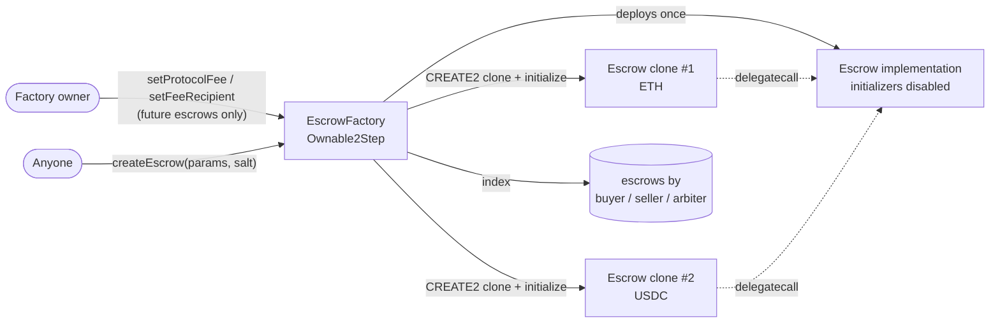
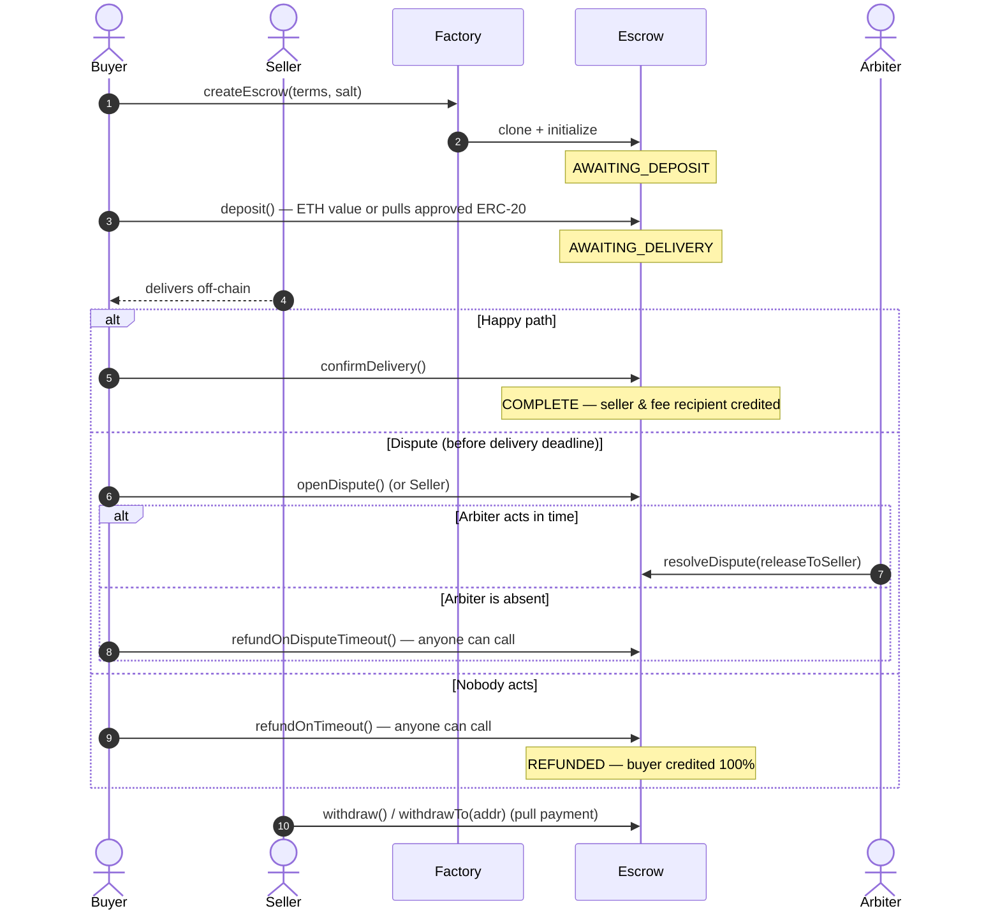
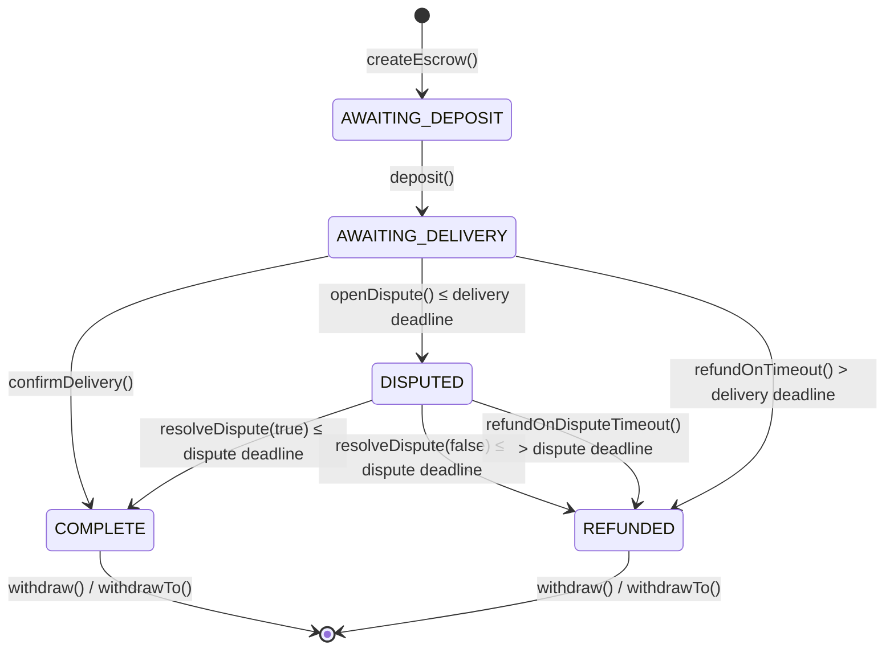

# Escrow Protocol

A trust-minimized escrow protocol for **native ETH and any standard ERC-20**. An `EscrowFactory`
deploys one cheap [EIP-1167](https://eips.ethereum.org/EIPS/eip-1167) clone per trade, at an
address you can predict before it exists. Each escrow has arbiter-based dispute resolution and
**permissionless timeouts, so funds can never be locked forever**.

Built with Solidity `0.8.28`, Foundry and OpenZeppelin 5. It has **192 tests** (unit, integration,
fuzz, and stateful invariant tests run against both ETH and ERC-20), with **100% line, branch and
function coverage** on every contract and script. Every change is checked in CI by Slither, a gas
snapshot and a coverage gate.

[](https://github.com/mahz24/defi-escrow/actions/workflows/ci.yml)
[](https://docs.soliditylang.org/en/v0.8.28/)
[](https://book.getfoundry.sh/)
[](https://docs.openzeppelin.com/contracts/5.x/)
[](#-testing)
[](./SECURITY.md#slither-triage)
[](./LICENSE)

---

## ✨ Highlights

- **Factory + minimal proxies.** Each trade is a 45-byte clone with isolated storage and funds.
  CREATE2 addresses are bound to the creator, so buyers can `approve` or share the escrow
  *before* it's deployed, and nobody can squat the address.
- **ETH and ERC-20, including the tricky ones.** `SafeERC20` handles USDT-style tokens,
  fee-on-transfer tokens are rejected, and `withdrawTo()` rescues USDC-blocklisted or
  non-receiving recipients. Each of these is covered by a dedicated malicious or quirky token mock.
- **Spec-first.** [`DESIGN.md`](./DESIGN.md) defines the state machine, storage layout,
  invariants and must-revert cases. The tests are written against it.
- **Stateful invariant testing.** 8 invariants run against ETH *and* ERC-20. Handlers mix random
  actions, time jumps and forced donations. A mutation check shows all 16 invariant checks catch
  an injected accounting bug.
- **Liveness by design.** An absent buyer or arbiter can't freeze funds. Anyone can trigger the
  refund after the deadline.
- **Gas-aware.** Storage is packed from 12 slots to 7 (about 20% cheaper `initialize`), with a
  transient-storage reentrancy guard (EIP-1153). A new trade costs about 3.7× less gas than
  deploying a standalone escrow.
- **Security write-up.** [`SECURITY.md`](./SECURITY.md) has the threat model, token-quirk
  matrix and Slither triage.
- **Production-style tooling.** `Ownable2Step` admin, encrypted-keystore deployment, Etherscan
  verification, Makefile, and CI with format, build, tests, gas snapshot, coverage gate and
  Slither SARIF.

---

## 🚀 Deployment

| Network | Version | Address | Etherscan |
|---|---|---|---|
| **Sepolia** | **v3** (single escrow) | `0x5056e4b39e335916741bb0d2e7a5F039CEf15495` | [Verified source](https://sepolia.etherscan.io/address/0x5056e4b39e335916741bb0d2e7a5f039cef15495#code) |
| Sepolia | v2 (legacy) | `0x6eF18B176d1d67AaF73F05413077B9842Fe83A5C` | [Verified source](https://sepolia.etherscan.io/address/0x6ef18b176d1d67aaf73f05413077b9842fe83a5c#code) |

> **v4 (factory + ERC-20)** is pending deployment. Run `make deploy-sepolia` and add the
> `EscrowFactory` address here. Version history is in the [changelog](./DESIGN.md#12-changelog).

---

## 🏗️ Architecture



- **Per-trade isolation.** Every clone has its own storage and balance.
- **Fee snapshot.** The protocol fee and recipient are copied into each escrow at creation.
  Changing them never affects live trades.
- **Discoverability.** `getEscrowsByParticipant(addr, offset, limit)` returns a user's trade
  history, and `EscrowCreated` lets indexers discover every trade.

## 📖 How a trade works



### State machine



The full transition table is in [`DESIGN.md`](./DESIGN.md#5-transition-table).

### Economics
- The protocol fee (default 1%, hard cap 5%) is charged **only when the seller gets paid**.
  Refunds always return 100%.
- Fee rounding favours the seller: `fee = amount * bps / 10_000` rounds down.

---

## 🪙 Token support

| Token type | Example | Supported | How |
|---|---|---|---|
| Native ETH | ETH | ✅ | `token = address(0)`, exact `msg.value` |
| Standard ERC-20 | DAI, WETH | ✅ | `SafeERC20.safeTransferFrom` |
| No return value | USDT | ✅ | `SafeERC20` |
| Blocklist | USDC | ✅ | Pull payments + `withdrawTo()` escape hatch |
| Transfer hooks | ERC-777-like | ✅ | `nonReentrant` + CEI |
| Fee-on-transfer | deflationary tokens | ❌ rejected | Balance-diff check reverts the deposit |
| Rebasing | stETH, AMPL | ❌ | Balance drifts from the recorded amount (documented) |

---

## 🧪 Testing

| Suite | Tests | What it proves |
|---|---|---|
| **Lifecycle** ([`EscrowLifecycleTests`](./test/unit/EscrowLifecycleTests.sol)) | 51 × 2 | Every function, revert, event and deadline boundary. Written once, **run for both ETH and a 6-decimals ERC-20**. |
| **ETH-specific** ([`EscrowEthTest`](./test/unit/EscrowEthTest.t.sol)) | 6 | Exact `msg.value`, rejecting receivers, `withdrawTo` rescue, reentrancy attack. |
| **ERC-20-specific** ([`EscrowErc20Test`](./test/unit/EscrowErc20Test.t.sol)) | 9 | USDT no-return, fee-on-transfer rejection, USDC blocklist + rescue, re-entrant token hooks during deposit/withdraw, donations. |
| **Initialization** ([`EscrowInitializeTest`](./test/unit/EscrowInitializeTest.t.sol)) | 19 | Locked implementation, no re-initialization, every parameter check (incl. `uint32` window overflow). |
| **Factory** ([`EscrowFactoryTest`](./test/unit/EscrowFactoryTest.t.sol)) | 21 | Predicted addresses, salt bound to creator, 45-byte clones, gas vs full deploy, indexing and pagination, fee snapshotting, `Ownable2Step`. |
| **Fuzz** ([`EscrowFuzzTest`](./test/fuzz/EscrowFuzzTest.t.sol)) | 12 | Properties for any input, with the asset itself fuzzed: exact fee split up to 1e30, conservation for any ruling, role checks, deadlines, predicted address for any creator/salt. 10,000 runs each in CI. |
| **Invariant** ([`test/invariant/`](./test/invariant)) | 8 × 2 | Stateful fuzzing with ghost variables and forced donations: conservation, solvency, donations never claimable, exclusive outcomes, monotonic state machine, immutable terms. |
| **Integration** ([`DeployEscrowFactoryTest`](./test/integration/DeployEscrowFactoryTest.t.sol)) | 7 | Runs the real deploy script, then drives ETH and ERC-20 trades end to end. |

```
╭──────────────────────────────────┬───────────────────┬───────────────────┬─────────────────┬─────────────────╮
│ File                             │ % Lines           │ % Statements      │ % Branches      │ % Funcs         │
├──────────────────────────────────┼───────────────────┼───────────────────┼─────────────────┼─────────────────┤
│ src/Escrow.sol                   │ 100.00%           │ 100.00%           │ 100.00%         │ 100.00%         │
│ src/EscrowFactory.sol            │ 100.00%           │ 100.00%           │ 100.00%         │ 100.00%         │
│ script/DeployEscrowFactory.s.sol │ 100.00%           │ 100.00%           │ 100.00%         │ 100.00%         │
│ script/HelperConfig.s.sol        │ 100.00%           │ 100.00%           │ 100.00%         │ 100.00%         │
╰──────────────────────────────────┴───────────────────┴───────────────────┴─────────────────┴─────────────────╯
```

### Gas

| Operation | Gas |
|---|---|
| Deploy `EscrowFactory` (includes the implementation) | ~2.37M (once) |
| `createEscrow` (clone + initialize + index) | ~400k – 465k |
| Standalone `Escrow` deployment, for comparison | ~1.53M + initialize |
| `deposit` — ETH / ERC-20 | ~17.5k / ~58k |
| `confirmDelivery` | ~62k |
| `openDispute` | ~14.5k |
| `withdraw` | ~17k (ETH) – 43k (ERC-20) |

Execution gas from the integration flows, excluding the 21k base transaction cost. Tracked in
[`.gas-snapshot`](./.gas-snapshot), and CI fails if gas changes without the snapshot being updated.

---

## 🔐 Security

The full analysis is in [`SECURITY.md`](./SECURITY.md) and [`DESIGN.md` §9](./DESIGN.md#9-security-notes).

- **Pull payments + `withdrawTo()`.** A broken or blocklisted receiver only hurts itself, and can redirect its own funds.
- **CEI + `ReentrancyGuardTransient`.** Proven against a re-entrant ETH receiver and a malicious token hook.
- **Safe initialization.** The implementation is locked, and clones are created and initialized atomically.
- **Accounting never reads balances.** `s_amount` is the source of truth. Donations and forced ETH are harmless, which is checked continuously by the invariants.
- **Liveness.** Both timeouts are permissionless.
- **Anti front-running.** Disputes close at the delivery deadline, and CREATE2 salts are bound to the creator.
- **Admin can't touch live trades.** The fee is snapshotted per escrow and hard-capped at 5%.
- **Static analysis.** Slither reports 0 high and 0 medium findings. Every low or informational finding is triaged.

### Known limitations
- The arbiter is **trusted**. Timeouts protect against an absent arbiter, not a dishonest one.
- Timeouts favour the buyer. A seller who delivered must dispute before the delivery deadline if the buyer doesn't confirm.
- Resolution is binary (no partial splits). Rebasing and fee-on-transfer tokens aren't supported.

---

## 🛠️ Tech stack

| Layer | Tool |
|---|---|
| Language | Solidity `0.8.28` (Cancun: transient storage) |
| Framework | [Foundry](https://book.getfoundry.sh/) (forge, cast, anvil) |
| Libraries | [OpenZeppelin Contracts 5.7](https://docs.openzeppelin.com/contracts/5.x/): `Clones`, `Initializable`, `SafeERC20`, `ReentrancyGuardTransient`, `Ownable2Step` |
| Testing | Unit, fuzz, stateful invariant and integration tests; malicious and quirky token mocks |
| Static analysis | [Slither](https://github.com/crytic/slither) |
| CI | GitHub Actions: fmt, build, tests, gas snapshot, coverage gate, Slither SARIF |
| Deployment | `forge script` + `HelperConfig`, encrypted keystore, Etherscan verification |

---

## 🚦 Getting started

### Prerequisites
- [Foundry](https://book.getfoundry.sh/getting-started/installation)
- (optional) [Slither](https://github.com/crytic/slither#how-to-install): `pip install slither-analyzer`

### Install, build and test

```bash
git clone --recurse-submodules https://github.com/mahz24/defi-escrow.git
cd defi-escrow
make build
make test            # everything
make test-unit       # unit + integration
make test-fuzz       # stateless fuzzing
make test-invariant  # stateful fuzzing (ETH + ERC-20)
make coverage
make slither
make help            # all commands
```

### Local walkthrough (Anvil)

```bash
make anvil           # terminal 1
make deploy-anvil    # terminal 2 — deploys the factory (owner = Anvil account #0)
```

Anvil accounts: **#0 buyer, #1 seller, #2 arbiter, #3 fee recipient**.

```bash
RPC=http://localhost:8545
FACTORY=<factory address from the deploy output>
BUYER=0xf39Fd6e51aad88F6F4ce6aB8827279cffFb92266
SELLER=0x70997970C51812dc3A010C7d01b50e0d17dc79C8
ARBITER=0x3C44CdDdB6a900fa2b585dd299e03d12FA4293BC
BUYER_PK=0xac0974bec39a17e36ba4a6b4d238ff944bacb478cbed5efcae784d7bf4f2ff80
SELLER_PK=0x59c6995e998f97a5a0044966f0945389dc9e86dae88c7a8412f4603b6b78690d
PARAMS="(address,address,address,address,uint256,uint256,uint256,uint256)"

# 1. Predict the escrow address, then create it (0.01 ETH, windows 1d / 7d / 3d)
SALT=$(cast keccak "order-1")
ESCROW=$(cast call $FACTORY "predictEscrowAddress(address,bytes32)(address)" $BUYER $SALT --rpc-url $RPC)
cast send $FACTORY "createEscrow($PARAMS,bytes32)" \
  "($BUYER,$SELLER,$ARBITER,0x0000000000000000000000000000000000000000,10000000000000000,86400,604800,259200)" $SALT \
  --private-key $BUYER_PK --rpc-url $RPC
cast codesize $ESCROW --rpc-url $RPC        # 45 — it's a minimal proxy

# 2. Deposit, confirm, withdraw
cast send $ESCROW "deposit()" --value 0.01ether --private-key $BUYER_PK --rpc-url $RPC
cast send $ESCROW "confirmDelivery()"           --private-key $BUYER_PK --rpc-url $RPC
cast send $ESCROW "withdraw()"                  --private-key $SELLER_PK --rpc-url $RPC

# 3. Trade history
cast call $FACTORY "getEscrowsByParticipant(address,uint256,uint256)(address[])" $SELLER 0 10 --rpc-url $RPC
```

<details>
<summary><b>Same flow with an ERC-20</b> (approve the escrow <i>before</i> it exists)</summary>

```bash
TOKEN=$(forge create test/mocks/MockERC20.sol:MockERC20 --broadcast --private-key $BUYER_PK --rpc-url $RPC \
  --constructor-args "Mock USD" mUSD 6 | grep "Deployed to" | awk '{print $3}')
cast send $TOKEN "mint(address,uint256)" $BUYER 1000000000 --private-key $BUYER_PK --rpc-url $RPC

SALT=$(cast keccak "order-2")
ESCROW=$(cast call $FACTORY "predictEscrowAddress(address,bytes32)(address)" $BUYER $SALT --rpc-url $RPC)
cast send $TOKEN "approve(address,uint256)" $ESCROW 1000000000 --private-key $BUYER_PK --rpc-url $RPC
cast send $FACTORY "createEscrow($PARAMS,bytes32)" "($BUYER,$SELLER,$ARBITER,$TOKEN,1000000000,86400,604800,259200)" $SALT \
  --private-key $BUYER_PK --rpc-url $RPC
cast send $ESCROW "deposit()"         --private-key $BUYER_PK --rpc-url $RPC
cast send $ESCROW "confirmDelivery()" --private-key $BUYER_PK --rpc-url $RPC
cast send $ESCROW "withdraw()"        --private-key $SELLER_PK --rpc-url $RPC
cast call $TOKEN "balanceOf(address)(uint256)" $SELLER --rpc-url $RPC   # 990000000 (1,000 mUSD − 1% fee)
```
</details>

### Sepolia deployment

```bash
cp .env.example .env                        # fill SEPOLIA_RPC_URL and ETHERSCAN_API_KEY
cast wallet import deployer --interactive   # encrypted keystore, no plaintext private keys
make deploy-sepolia                         # deploys + verifies the factory and the implementation
make verify FACTORY=0x...                   # re-verify if Etherscan timed out
```

---

## 📁 Project structure

```
defi-escrow/
├── src/
│   ├── Escrow.sol                        # Clone-able escrow for ETH / ERC-20 (NatSpec documented)
│   └── EscrowFactory.sol                 # CREATE2 minimal-proxy factory + participant index
├── script/
│   ├── DeployEscrowFactory.s.sol         # Deployment script
│   └── HelperConfig.s.sol                # Per-network parameters (Anvil / Sepolia)
├── test/
│   ├── utils/EscrowTestBase.sol          # Asset-agnostic fixture (ETH or ERC-20)
│   ├── unit/
│   │   ├── EscrowLifecycleTests.sol      # 51 shared tests, run for ETH and ERC-20
│   │   ├── EscrowEthTest.t.sol           # ETH suite + ETH edge cases
│   │   ├── EscrowErc20Test.t.sol         # ERC-20 suite + token quirks
│   │   ├── EscrowInitializeTest.t.sol    # Initialization rules
│   │   └── EscrowFactoryTest.t.sol       # Factory behaviour
│   ├── fuzz/EscrowFuzzTest.t.sol         # 12 property-based tests
│   ├── invariant/                        # Handler + 8 invariants × (ETH, ERC-20)
│   ├── integration/DeployEscrowFactoryTest.t.sol
│   └── mocks/                            # MockERC20, FeeOnTransfer, NoReturn (USDT), Blocklist (USDC),
│                                         # ReentrantToken, RejectingReceiver, ReentrantReceiver
├── DESIGN.md                             # Spec: architecture, storage layout, invariants, security notes
├── SECURITY.md                           # Threat model, token matrix, Slither triage
├── .gas-snapshot                         # Gas baseline checked in CI
├── slither.config.json
├── foundry.toml
└── Makefile
```

---

## 🔮 Roadmap

- [x] ~~EscrowFactory with EIP-1167 minimal proxies~~ (v4)
- [x] ~~ERC-20 support via `SafeERC20`~~ (v4)
- [ ] **Partial resolutions:** `resolveDispute(sellerShareBps)` so the arbiter can split funds.
- [ ] **Multi-arbiter** (2-of-3) resolution.
- [ ] **EIP-2612 `permit`** to create, approve and deposit in a single transaction.
- [ ] **Frontend** (Next.js + wagmi/viem) and an indexer (Ponder / The Graph) on `EscrowCreated`.

---

## 📄 License

[MIT](./LICENSE)

## 🙋 Author

Built by [mahz24](https://github.com/mahz24) as part of the
[blockchain-journey](https://github.com/mahz24/blockchain-journey) portfolio.
