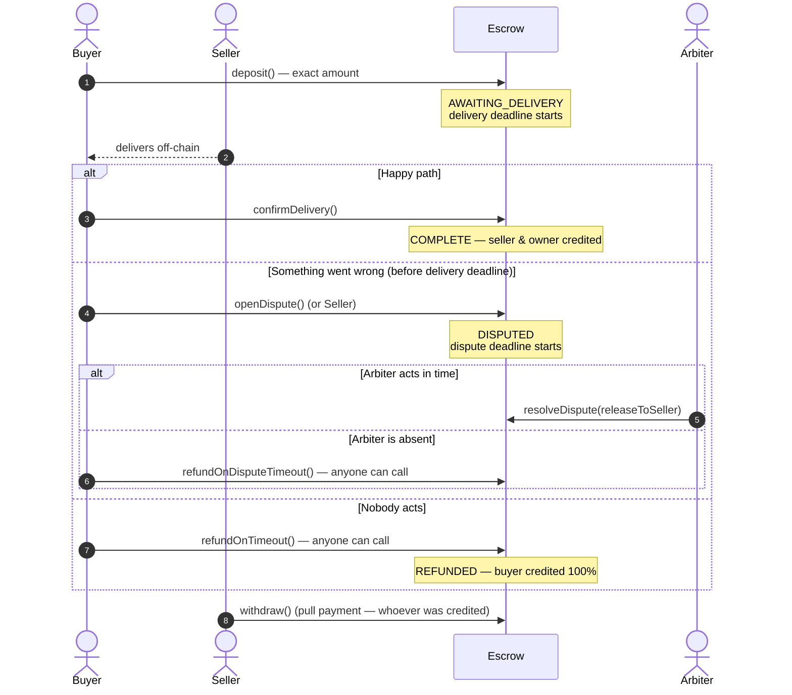
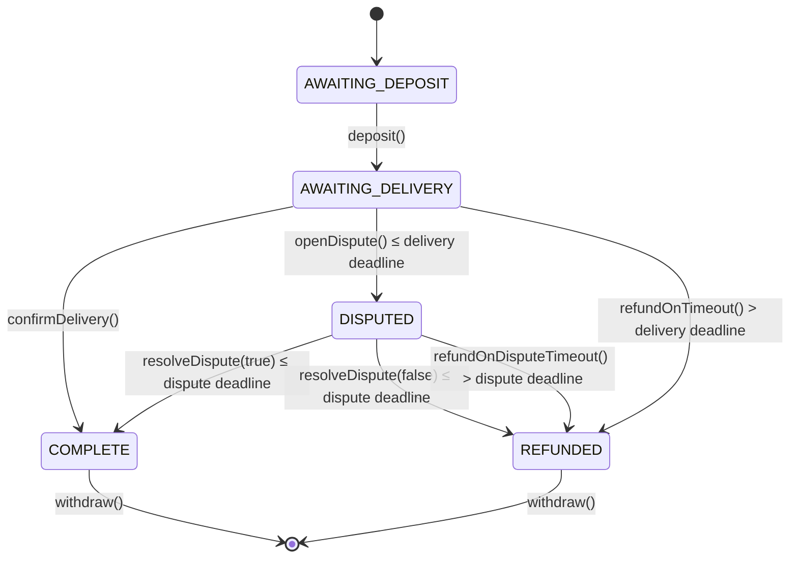

# Escrow Smart Contract

A trust-minimized ETH escrow between a buyer and a seller. It has arbiter-based dispute resolution
and **permissionless timeouts, so funds can never be locked forever**.

Built with Solidity `0.8.19` and Foundry. It has **102 tests** (unit, integration, fuzz and
stateful invariant tests) and **100% line, branch and function coverage**. Every change is
checked in CI by Slither, a gas snapshot and a coverage gate.

[](https://github.com/mahz24/defi-escrow/actions/workflows/ci.yml)
[](https://docs.soliditylang.org/en/v0.8.19/)
[](https://book.getfoundry.sh/)
[](#-testing)
[](./SECURITY.md#slither-triage)
[](./LICENSE)

---

## ✨ Highlights

- **Formal-ish spec first.** [`DESIGN.md`](./DESIGN.md) defines the state machine, transition
  table, invariants and must-revert cases *before* the code. The tests are written against that spec.
- **Stateful invariant testing.** A handler drives random sequences of deposits, disputes,
  resolutions, timeouts, withdrawals and time jumps (128k+ calls per run). After every call, 8 accounting
  and state-machine invariants are checked. A mutation check confirms the suite actually catches bugs.
- **Liveness by design.** An absent buyer or an absent arbiter can't freeze funds. Anyone can
  trigger the refund once the corresponding deadline passes.
- **Pull payments + strict CEI.** A malicious or broken receiver only hurts itself. A re-entrancy
  attack is simulated and fails in the tests.
- **Security write-up.** [`SECURITY.md`](./SECURITY.md) includes a threat model, the Slither triage and known limitations.
- **Production-style tooling.** HelperConfig deployment, encrypted keystore (no plaintext keys),
  Etherscan verification, Makefile, and CI with format, build, tests, gas snapshot, coverage gate and Slither SARIF.

---

## 🚀 Deployment

| Network | Version | Address | Etherscan |
|---|---|---|---|
| **Sepolia** | **v3** (current) | `0x5056e4b39e335916741bb0d2e7a5F039CEf15495` | [Verified source](https://sepolia.etherscan.io/address/0x5056e4b39e335916741bb0d2e7a5f039cef15495#code) |
| Sepolia | v2 (legacy) | `0x6eF18B176d1d67AaF73F05413077B9842Fe83A5C` | [Verified source](https://sepolia.etherscan.io/address/0x6ef18b176d1d67aaf73f05413077b9842fe83a5c#code) |

The v3 deployment uses the Sepolia parameters from [`HelperConfig`](./script/HelperConfig.s.sol): 0.01 ETH escrow,
1% fee, and deposit/delivery/dispute windows of 1/7/3 days. You can read the source or interact with the contract in
Etherscan's *Read/Write Contract* tabs. Version history is in the [changelog](./DESIGN.md#12-changelog).

---

## 📖 How it works



### State machine



The full transition table (callers, time conditions, effects and events) is in
[`DESIGN.md`](./DESIGN.md#4-transition-table).

### Economics
- The **protocol fee** (default 1%, hard cap 5%) is charged **only when the seller gets paid**.
  Refunds always return 100% to the buyer.
- Fee rounding favours the seller: `fee = amount * bps / 10_000` rounds down.

---

## 🧪 Testing

| Suite | File | What it proves |
|---|---|---|
| **Unit** (78) | [`test/unit/EscrowTest.t.sol`](./test/unit/EscrowTest.t.sol) | Every function, every revert, every event, and exact deadline boundaries (`deadline` vs `deadline + 1`). It also covers reentrancy and rejecting-receiver attacks with dedicated mocks. |
| **Fuzz** (10) | [`test/fuzz/EscrowFuzzTest.t.sol`](./test/fuzz/EscrowFuzzTest.t.sol) | Properties that hold for *any* input: the fee split is exact and capped for amounts up to 1e30, dispute resolution conserves funds, only the right roles can act, and deadlines are respected for any timestamp. 10,000 runs per test in CI. |
| **Invariant** (8) | [`test/invariant/`](./test/invariant) | Stateful fuzzing through a handler with ghost variables. It checks fund conservation, solvency, exclusive outcomes, monotonic state machine, deadline consistency and the fee cap across random multi-step scenarios. |
| **Integration** (6) | [`test/integration/DeployEscrowTest.t.sol`](./test/integration/DeployEscrowTest.t.sol) | Runs the real deploy script, validates the per-network config, and drives full lifecycles end to end (including the "arbiter disappears" scenario). |

```
╭────────────────────────────┬──────────────────┬───────────────────┬────────────────┬─────────────────╮
│ File                       │ % Lines          │ % Statements      │ % Branches     │ % Funcs         │
├────────────────────────────┼──────────────────┼───────────────────┼────────────────┼─────────────────┤
│ src/Escrow.sol             │ 100.00% (83/83)  │ 100.00% (102/102) │ 100.00% (27/27)│ 100.00% (16/16) │
│ script/DeployEscrow.s.sol  │ 100.00% (7/7)    │ 100.00% (9/9)     │ 100.00% (0/0)  │ 100.00% (1/1)   │
│ script/HelperConfig.s.sol  │ 100.00% (10/10)  │ 100.00% (6/6)     │ 100.00% (2/2)  │ 100.00% (4/4)   │
╰────────────────────────────┴──────────────────┴───────────────────┴────────────────┴─────────────────╯
```

### Gas

| Function | Gas (median) |
|---|---|
| Deployment | ~1,011,000 |
| `deposit` | 67,532 |
| `confirmDelivery` | 74,347 |
| `openDispute` | 52,258 |
| `resolveDispute` | 52,895 – 76,968 |
| `refundOnTimeout` | 52,307 |
| `refundOnDisputeTimeout` | 52,308 |
| `withdraw` | 32,247 |

Tracked in [`.gas-snapshot`](./.gas-snapshot). CI fails if gas usage changes without the snapshot being updated.

---

## 🔐 Security

Full details are in [`SECURITY.md`](./SECURITY.md) and [`DESIGN.md` §9](./DESIGN.md#9-security-notes).

- **Pull payments.** State transitions only credit balances, and ETH moves only in `withdraw()`.
- **CEI + reentrancy test.** A malicious `ReentrantReceiver` tries to double-withdraw and fails.
- **`call` instead of `transfer`.** Works with smart-contract wallets (Safe, ERC-4337). The return value is checked.
- **Forced-ETH safe.** Accounting never reads `address(this).balance`.
- **Liveness.** `refundOnTimeout()` and `refundOnDisputeTimeout()` are callable by anyone.
- **Anti front-running.** `openDispute()` is closed after the delivery deadline, so a seller can't
  front-run the buyer's refund.
- **Static analysis.** Slither reports 0 high and 0 medium findings. Every low or informational finding is triaged.

### Known limitations
- The arbiter is **trusted**. Timeouts protect against an *absent* arbiter, not a dishonest one.
- Timeouts favour the buyer. A seller who delivered but never got a confirmation must open a dispute before the delivery deadline.
- Resolution is binary (no partial splits), payments are ETH only, and there is one trade per deployment.

---

## 🛠️ Tech stack

| Layer | Tool |
|---|---|
| Language | Solidity `0.8.19` |
| Framework | [Foundry](https://book.getfoundry.sh/) (forge, cast, anvil) |
| Testing | Unit, fuzz, stateful invariant and integration tests; custom attack mocks |
| Static analysis | [Slither](https://github.com/crytic/slither) |
| CI | GitHub Actions: fmt, build, tests, gas snapshot, coverage gate, Slither SARIF |
| Deployment | `forge script` + `HelperConfig`, encrypted keystore |
| Verification | Etherscan |

---

## 🚦 Getting started

### Prerequisites
- [Foundry](https://book.getfoundry.sh/getting-started/installation)
- (optional) [Slither](https://github.com/crytic/slither#how-to-install): `pip install slither-analyzer`

### Install, build and test

```bash
git clone --recurse-submodules https://github.com/mahz24/defi-escrow.git
cd defi-escrow
make build
make test            # everything
make test-unit       # unit + integration
make test-fuzz       # stateless fuzzing
make test-invariant  # stateful fuzzing
make coverage
make slither
make help            # all commands
```

### Local deployment and walkthrough (Anvil)

```bash
make anvil           # terminal 1
make deploy-anvil    # terminal 2
```

The Anvil config uses the default accounts: **#0 buyer, #1 seller, #2 arbiter, #3 owner**. Try the
full flow with `cast`:

```bash
ESCROW=<deployed address>
RPC=http://localhost:8545
BUYER_PK=0xac0974bec39a17e36ba4a6b4d238ff944bacb478cbed5efcae784d7bf4f2ff80
SELLER_PK=0x59c6995e998f97a5a0044966f0945389dc9e86dae88c7a8412f4603b6b78690d

cast send $ESCROW "deposit()" --value 0.01ether --private-key $BUYER_PK --rpc-url $RPC
cast send $ESCROW "confirmDelivery()"             --private-key $BUYER_PK --rpc-url $RPC
cast call $ESCROW "s_pendingWithdrawals(address)(uint256)" 0x70997970C51812dc3A010C7d01b50e0d17dc79C8 --rpc-url $RPC
cast send $ESCROW "withdraw()"                    --private-key $SELLER_PK --rpc-url $RPC
```

### Sepolia deployment

```bash
cp .env.example .env                 # fill SEPOLIA_RPC_URL and ETHERSCAN_API_KEY
cast wallet import deployer --interactive   # encrypted keystore, no plaintext private keys
make deploy-sepolia                  # deploys + verifies on Etherscan
make verify                          # re-verify if Etherscan timed out
```

---

## 📁 Project structure

```
defi-escrow/
├── src/
│   └── Escrow.sol                     # The contract (NatSpec documented)
├── script/
│   ├── DeployEscrow.s.sol             # Deployment script
│   └── HelperConfig.s.sol             # Per-network parameters (Anvil / Sepolia)
├── test/
│   ├── unit/EscrowTest.t.sol          # 78 unit tests
│   ├── fuzz/EscrowFuzzTest.t.sol      # 10 property-based fuzz tests
│   ├── invariant/
│   │   ├── EscrowHandler.t.sol        # Stateful fuzzing handler + ghost variables
│   │   └── EscrowInvariantTest.t.sol  # 8 invariants
│   ├── integration/DeployEscrowTest.t.sol  # Deploy script + end-to-end lifecycles
│   └── mocks/
│       ├── RejectingReceiver.sol      # Reverts on receive (griefing)
│       └── ReentrantReceiver.sol      # Re-enters withdraw() (reentrancy)
├── DESIGN.md                          # Spec: state machine, invariants, security notes
├── SECURITY.md                        # Threat model, Slither triage
├── .gas-snapshot                      # Gas baseline checked in CI
├── slither.config.json
├── foundry.toml
└── Makefile
```

---

## 🔮 Roadmap

- [ ] **EscrowFactory** with EIP-1167 minimal proxies: cheap per-trade escrows, indexed by participant.
- [ ] **ERC-20 support** via `SafeERC20`, tested against fee-on-transfer and non-standard tokens.
- [ ] **Partial resolutions**: `resolveDispute(sellerShareBps)` so the arbiter can split funds.
- [ ] **Multi-arbiter** (2-of-3) resolution.
- [ ] **Frontend** (Next.js + wagmi/viem) and an indexer (Ponder / The Graph).

---

## 📄 License

[MIT](./LICENSE)

## 🙋 Author

Built by [mahz24](https://github.com/mahz24) as part of the
[blockchain-journey](https://github.com/mahz24/blockchain-journey) portfolio.
