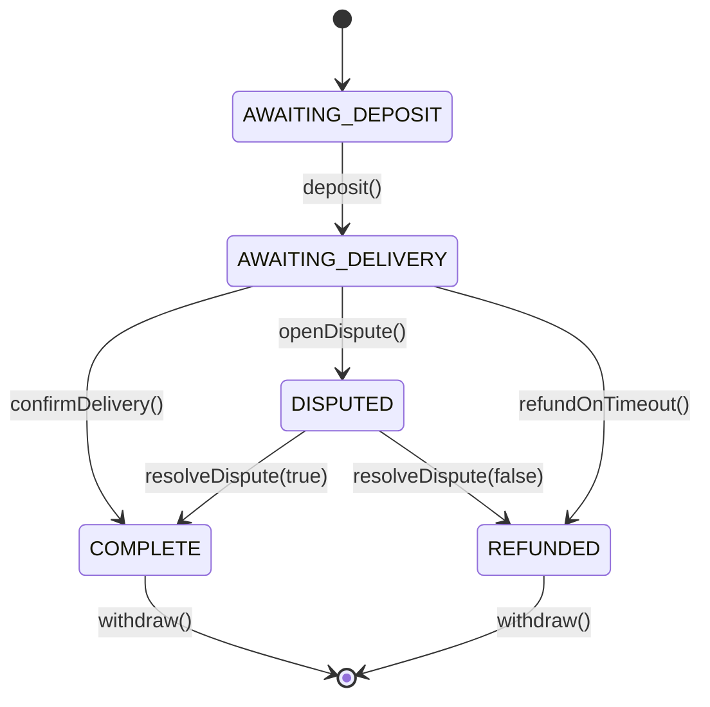

# Escrow Smart Contract

A decentralized escrow protocol on Ethereum that holds funds between a buyer and a seller, with arbiter-mediated dispute resolution and time-based refunds.

Built with Solidity `0.8.19` and Foundry. **100% test coverage** across lines, statements, branches, and functions.

[](https://docs.soliditylang.org/en/v0.8.19/)
[](https://book.getfoundry.sh/)
[](https://github.com/mahz24/defi-escrow/actions/workflows/ci.yml)
[]()
[](https://opensource.org/licenses/MIT)

---

## 🚀 Live Deployment

| Network | Address | Etherscan |
|---|---|---|
| **Sepolia** | `0x6eF18B176d1d67AaF73F05413077B9842Fe83A5C` | [View verified source](https://sepolia.etherscan.io/address/0x6ef18b176d1d67aaf73f05413077b9842fe83a5c#code) |

The contract source code is verified on Etherscan — anyone can read the Solidity directly or interact with the contract through the "Write Contract" tab.

---

## 📖 What It Does

This contract acts as a trustless intermediary for a transaction between two parties:

1. **Buyer** deposits ETH into the contract (locked until delivery or dispute).
2. **Seller** delivers the agreed product or service off-chain.
3. **Buyer** confirms delivery → funds are credited to the seller (minus a protocol fee).
4. If something goes wrong, either party can open a dispute, and the **arbiter** decides the outcome.
5. If the seller never delivers and the buyer becomes unresponsive, **anyone** can trigger a refund after a deadline (liveness guarantee).

All payouts use a **pull-payment pattern** — beneficiaries call `withdraw()` to receive their funds, instead of the contract pushing ETH to them. This prevents griefing attacks where a malicious contract could lock funds by reverting on receipt.

---

## 🔄 State Machine



The full transition table, including allowed callers, side effects, and revert conditions, lives in [`DESIGN.md`](./DESIGN.md).

---

## ✨ Features

- **Custom errors** — gas-efficient reverts with informative parameters (e.g. `Escrow__WrongState(expected, current)`).
- **Pull-payment pattern** — finalization is decoupled from ETH transfer; recipients withdraw on their own terms.
- **CEI compliance** — every fund-moving function follows Checks → Effects → Interactions to prevent reentrancy.
- **Liveness guarantee** — `refundOnTimeout()` is callable by anyone after the delivery deadline, preventing permanently locked funds if the buyer loses access to their wallet.
- **Immutable roles** — `buyer`, `seller`, `arbiter`, and `owner` are set at deploy time and cannot be reassigned.
- **Configurable protocol fee** — capped at 5% (500 bps) in the constructor as a safety bound.
- **Public state getters** — all state variables are inspectable on-chain without custom view functions.

---

## 🛠️ Tech Stack

| Layer | Tool |
|---|---|
| Language | Solidity `0.8.19` |
| Framework | [Foundry](https://book.getfoundry.sh/) |
| Testing | Forge (unit + edge cases + mock contracts) |
| Deployment | `forge script` with `HelperConfig` pattern |
| Verification | Etherscan |
| Testnet | Sepolia |

---

## 🚦 Getting Started

### Prerequisites

- [Foundry](https://book.getfoundry.sh/getting-started/installation) (`forge`, `cast`, `anvil`)
- Git

### Clone and install

```bash
git clone https://github.com/mahz24/defi-escrow.git
cd defi-escrow
forge install
```

### Build

```bash
forge build
```

### Run tests

```bash
forge test
```

For verbose output (call traces on failures):

```bash
forge test -vvv
```

### Check coverage

```bash
forge coverage
```

Expected output:

```
| File                             | % Lines  | % Statements | % Branches | % Funcs  |
| src/Escrow.sol                   | 100.00%  | 100.00%      | 100.00%    | 100.00%  |
| test/mocks/RejectingReceiver.sol | 100.00%  | 100.00%      | —          | 100.00%  |
```

### Format

```bash
forge fmt
```

---

## 🚢 Deployment

The deployment is driven by two scripts:

- `script/HelperConfig.s.sol` — returns network-specific config (addresses, fee, windows) based on `block.chainid`.
- `script/DeployEscrow.s.sol` — uses `HelperConfig` and deploys the contract.

### Local (Anvil)

```bash
anvil                       # in one terminal
forge script script/DeployEscrow.s.sol --rpc-url http://localhost:8545 --private-key <ANVIL_KEY> --broadcast
```

### Sepolia

1. Create a `.env` file based on `.env.example`:

   ```
   SEPOLIA_RPC_URL=https://eth-sepolia.g.alchemy.com/v2/<YOUR_KEY>
   PRIVATE_KEY=0x<YOUR_PRIVATE_KEY>
   ETHERSCAN_API_KEY=<YOUR_ETHERSCAN_KEY>
   ```

2. Load the variables into your shell:

   ```bash
   # bash / git bash
   source .env
   ```

3. Deploy and verify in one command:

   ```bash
   forge script script/DeployEscrow.s.sol \
     --rpc-url $SEPOLIA_RPC_URL \
     --private-key $PRIVATE_KEY \
     --broadcast \
     --verify \
     --etherscan-api-key $ETHERSCAN_API_KEY
   ```

---

## 📁 Project Structure

```
defi-escrow/
├── src/
│   └── Escrow.sol              # Main contract
├── test/
│   ├── unit/
│   │   └── EscrowTest.t.sol    # 52 tests
│   └── mocks/
│       └── RejectingReceiver.sol  # ETH-rejecting mock for failure paths
├── script/
│   ├── DeployEscrow.s.sol      # Deployment script
│   └── HelperConfig.s.sol      # Per-network configuration
├── DESIGN.md                   # State machine, invariants, security notes
├── foundry.toml                # Foundry configuration
└── README.md
```

---

## 🔐 Security Considerations

The complete security analysis lives in [`DESIGN.md`](./DESIGN.md). Key points:

- **ETH transfer method.** Uses `call{value: ...}("")` with mandatory success check, not `transfer` / `send` — the 2300-gas stipend of the latter is insufficient for many smart-contract receivers.
- **Reentrancy.** The pull-payment pattern decouples state changes from ETH transfers. State updates are always applied before any external call, following CEI strictly.
- **Forced ETH injection.** The contract never relies on `address(this).balance` for internal logic. The `i_expectedAmount` immutable is the source of truth for the locked amount, immune to `selfdestruct` / `coinbase` manipulation.
- **Timestamp manipulation.** Validator wiggle of ~15 seconds is negligible compared to the deadline scale (hours/days). Acknowledged and documented.

### Known limitations

- **Single arbiter** — no multi-sig or quorum support. The arbiter is a fully trusted role.
- **No dispute window after confirmation** — once the buyer calls `confirmDelivery()`, the seller's payment is final. The buyer assumes full risk at confirmation.
- **No partial refunds in disputes** — the arbiter's decision is binary (release-to-seller or full-refund-to-buyer). No splits.
- **Fixed escrow amount** — `expectedAmount` is set at deploy time; `deposit()` must match exactly.

---

## 🔮 Future Improvements

- **ERC-20 support** — accept arbitrary tokens, not just native ETH.
- **Multi-arbiter resolution** — 2-of-3 or N-of-M voting for higher-trust scenarios.
- **Partial refunds** — let the arbiter split funds between parties.
- **Factory contract** — `EscrowFactory` to deploy individual escrows per trade, indexed by participant.
- **Subgraph indexer** — surface all escrows, their states, and history for a friendly UI.
- **Foundry invariant tests** — fuzz the state machine to verify invariants hold across random call sequences.

---

## 📄 License

[MIT](./LICENSE)

---

## 🙋 Author

Built by [mahz24](https://github.com/mahz24) as part of an ongoing Web3 learning journey. Part of the [blockchain-journey](https://github.com/mahz24/blockchain-journey) portfolio.
